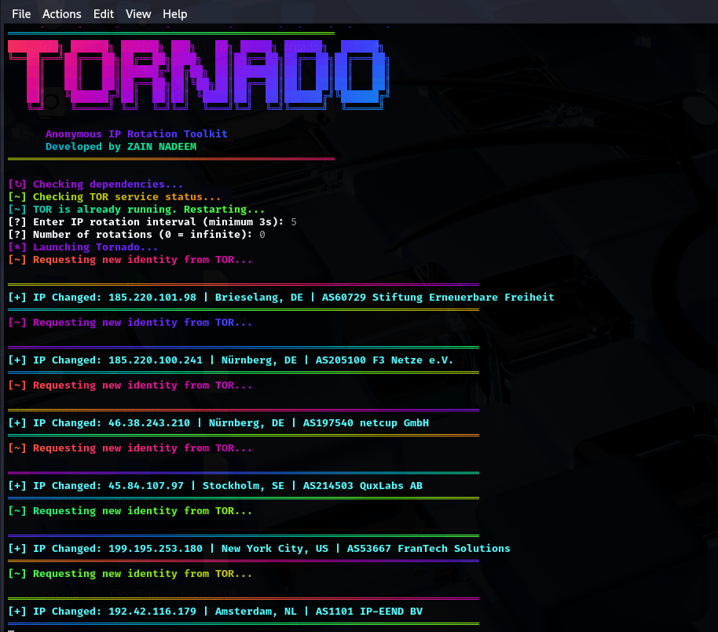

# Tornado

**An advanced TOR IP rotation tool for ethical hackers and cybersecurity professionals.**

> Developed by **Zain Nadeem**

Tornado is a powerful shell-based utility that integrates with the TOR network to rotate your IP address automatically at user-defined intervals. Designed for professionals who need fast, reliable, and anonymous IP switching with detailed IP/location visibility.

---

## ✨ Features

- 🌍 Automatic TOR IP rotation
- 🛡️ Anonymous browsing with country/location details
- 🔁 Set custom rotation interval and loop count
- 🔄 Auto-start & restart of TOR service
- 🌈 Stylish terminal UI with colored output
- 🔒 Secure and optimized for Kali Linux

---

## 📸 Screenshot



```bash
[*] Checking TOR service...
[~] TOR is already running. Restarting...
[?] Enter IP rotation interval (seconds): 5
[?] Number of rotations (0 = infinite): 0
[*] Launching Tornado...

[~] Requesting new identity from TOR...
[+] IP Changed: 198.98.51.189 | New York City, US | AS53667 FranTech Solutions

```
📦 Installation
Kali Linux (via GitHub)

```bash
git clone https://github.com/zainnadeem786/tornado.git
cd tornado
chmod +x tornado.sh
sudo ./tornado.sh
```

(Upcoming) Debian Package
Soon you’ll be able to install via:

```bash
sudo apt install tornado
```

📋 Requirements
Tornado uses the following tools (auto-installed silently):

```bash
-tor
-curl
-jq
-figlet
-lolcat
```

🚀 Usage
```bash
sudo ./tornado.sh
```

- Enter the rotation interval (minimum 3 seconds)
- Specify the number of rotations (0 = infinite)
- Monitor colorful, real-time IP changes directly in the terminal


🧠 Why Tornado?

- Designed for security professionals, red teamers, and pen-testers
- Minimal system overhead with maximum anonymity
- Works flawlessly with Kali Linux and the TOR network


🛠️ Developer
Zain Nadeem
Ethical Hacker | Red Teamer | Developer
GitHub: @zainnadeem786


